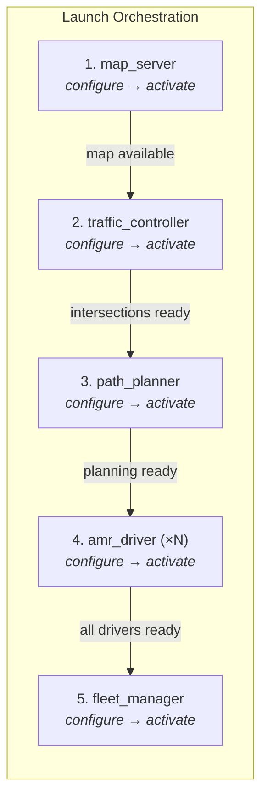
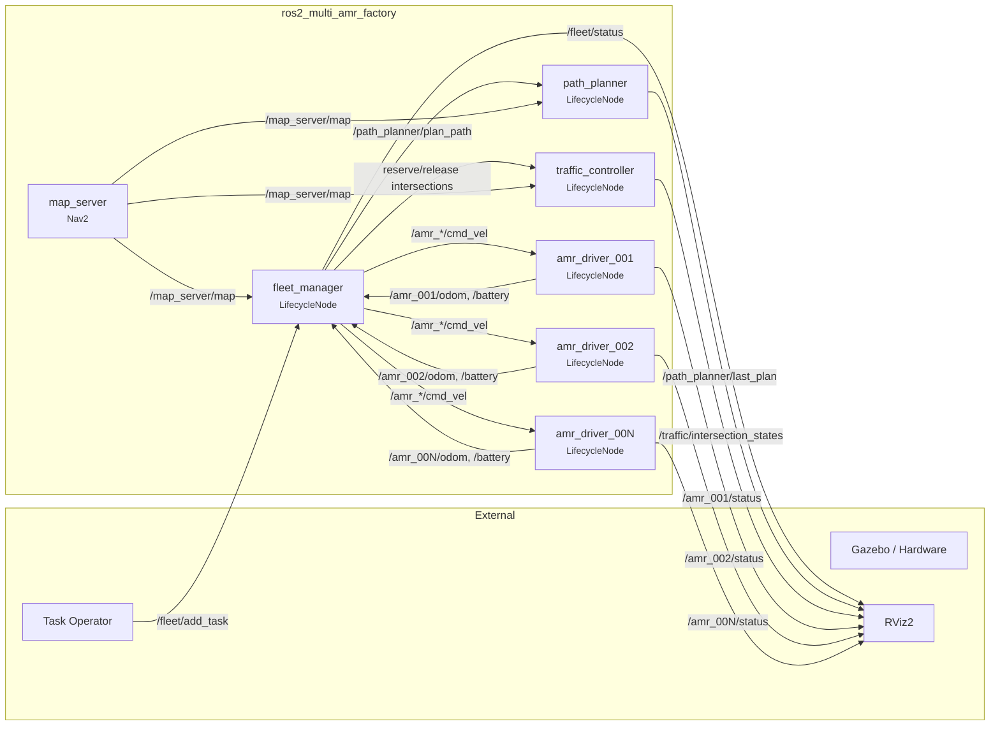
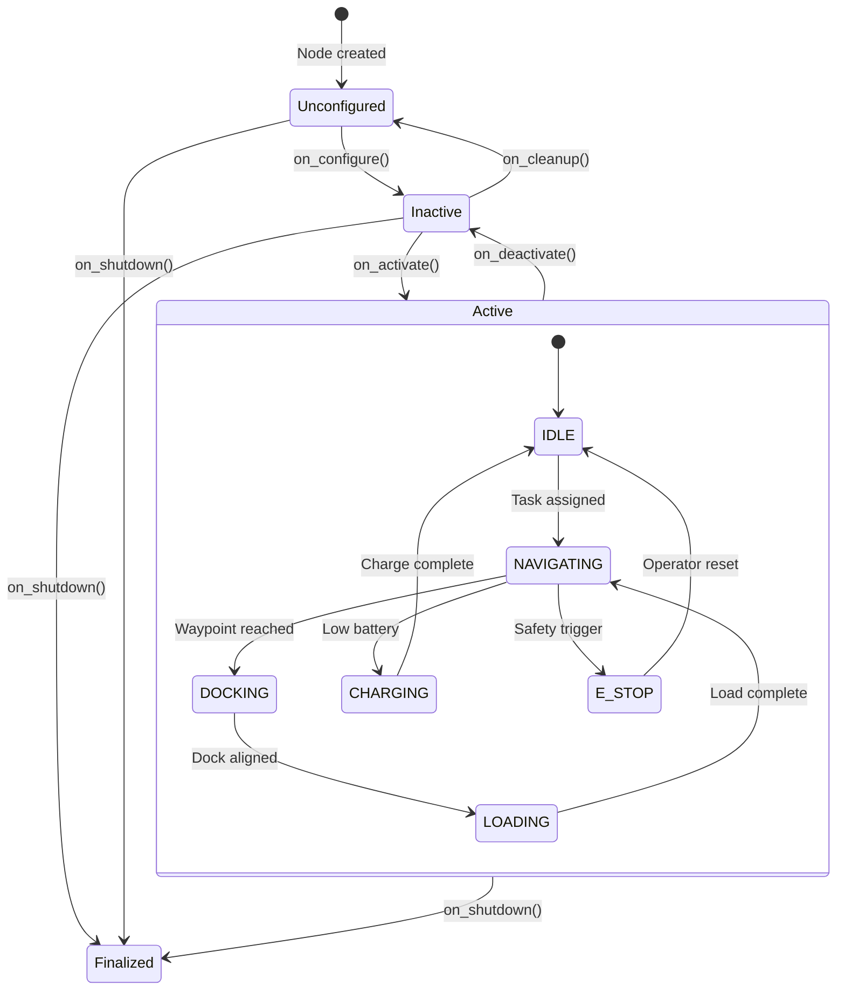

# ROS2 Architecture — Multi-AMR Factory Coordination

This document describes the ROS2 Humble integration layer of the project. The ROS2 nodes wrap the pure-Python simulation (in `src/`) into production-grade, lifecycle-managed ROS2 components with standardized fleet interfaces.

**Author:** Muskaan Maheshwari

## System Overview

The factory fleet runs as a set of ROS2 lifecycle nodes orchestrated by the launch file. The startup sequence guarantees that the map is loaded, traffic control is initialized, and path planning is ready before the fleet coordinator begins assigning tasks.



## Node Graph

All inter-node communication uses ROS2 topics and services. Arrows show dataflow direction.



## Topic & Service Map

### fleet_manager

| Direction | Name | Type | QoS | Description |
|-----------|------|------|-----|-------------|
| **Pub** | `/fleet/status` | `std_msgs/String` | Reliable / Transient Local | JSON fleet summary (robots, tasks, utilization) |
| **Pub** | `/fleet/robot_count` | `std_msgs/Int32` | Reliable / Transient Local | Active robot count |
| **Pub** | `/fleet/utilization_percent` | `std_msgs/Float32` | Reliable / Transient Local | Fleet utilization 0–100% |
| **Pub** | `/fleet/task_completed` | `std_msgs/String` | Reliable | Task completion notification (JSON) |
| **Sub** | `/fleet/add_task` | `std_msgs/String` | Reliable | Add production task (JSON request) |
| **Sub** | `/<robot_id>/odom` | `nav_msgs/Odometry` | Best Effort | Per-robot odometry |
| **Sub** | `/<robot_id>/battery` | `sensor_msgs/BatteryState` | Best Effort | Per-robot battery state |
| **Srv** | `/fleet/assign_task` | `std_srvs/Trigger` | — | Trigger task assignment algorithm |
| **Srv** | `/fleet/get_status` | `std_srvs/Trigger` | — | Get detailed fleet status on demand |

### traffic_controller

| Direction | Name | Type | QoS | Description |
|-----------|------|------|-----|-------------|
| **Pub** | `/traffic/intersection_states` | `std_msgs/String` | Reliable / Transient Local | All intersection states (FREE, CLAIMED, OCCUPIED) JSON |
| **Pub** | `/traffic/deadlock_alert` | `std_msgs/String` | Reliable | Deadlock detection & resolution method (JSON) |
| **Srv** | `/traffic/reserve_intersection` | Custom | — | Request intersection reservation |
| **Srv** | `/traffic/release_intersection` | Custom | — | Release reserved intersection |

### path_planner

| Direction | Name | Type | QoS | Description |
|-----------|------|------|-----|-------------|
| **Pub** | `/path_planner/last_plan` | `nav_msgs/Path` | Reliable | Last computed path with waypoints |
| **Pub** | `/path_planner/plan_stats` | `std_msgs/String` | Reliable | Planning statistics (length, time, curvature) JSON |
| **Srv** | `/path_planner/plan_path` | Custom | — | Plan path from start to goal pose |

### amr_driver (per robot)

| Direction | Name | Type | QoS | Description |
|-----------|------|------|-----|-------------|
| **Pub** | `/<robot_id>/odom` | `nav_msgs/Odometry` | Best Effort | Robot pose (x, y, θ) and twist (v, ω) at 10 Hz |
| **Pub** | `/<robot_id>/battery` | `sensor_msgs/BatteryState` | Best Effort | Battery %, voltage, current, health at 10 Hz |
| **Pub** | `/<robot_id>/status` | `std_msgs/String` | Reliable / Transient Local | Robot state (IDLE, NAVIGATING, DOCKING, LOADING, UNLOADING, CHARGING) JSON |
| **Pub** | `/<robot_id>/turret_state` | `std_msgs/Float64` | Best Effort | Turret heading (radians) |
| **Sub** | `/<robot_id>/cmd_vel` | `geometry_msgs/Twist` | Best Effort | Linear (x m/s) and angular (z rad/s) velocity |
| **Sub** | `/<robot_id>/turret_cmd` | `std_msgs/Float64` | Best Effort | Turret target heading (radians) |
| **Srv** | `/<robot_id>/emergency_stop` | `std_srvs/Empty` | — | Immediately halt robot, set E_STOP state |
| **Srv** | `/<robot_id>/reset` | `std_srvs/Trigger` | — | Reset robot to IDLE state |

## Launch Sequence

The launch file orchestrates startup in dependency order. Each node waits for its dependencies via ROS2 lifecycle transitions.

```bash
# Terminal 1: Launch full factory fleet (5 robots, 3 charging stations)
ros2 launch ros2_nodes factory_fleet.launch.py num_robots:=5

# Terminal 2: Monitor fleet
ros2 topic echo /fleet/status

# Terminal 3: Add a task
ros2 topic pub --once /fleet/add_task std_msgs/msg/String \
  "{data: '{\"pickup_station\": \"CELL_ASSEMBLY_1\", \"dropoff_station\": \"MODULE_PACKING_1\", \"priority\": 1}'}"
```

### Launch Parameters

| Parameter | Default | Type | Description |
|-----------|---------|------|-------------|
| `num_robots` | 3 | int | Number of AMR robots to launch |
| `start_x` | 0.0 | float | Initial X position of first robot (m) |
| `start_y` | 0.0 | float | Initial Y position of first robot (m) |
| `robot_spacing` | 5.0 | float | Distance between robot starting positions (m) |
| `update_rate` | 10 | int | Node update frequency (Hz) |
| `enable_gazebo` | false | bool | Enable Gazebo simulator integration |

## Parameter Reference

All parameters are declared with defaults and can be overridden via launch arguments or YAML config. Runtime changes via `ros2 param set` trigger reinitialization of affected components.

### fleet_manager

| Parameter | Default | Description |
|---|---|---|
| `update_rate_hz` | `10.0` | Task assignment loop frequency |
| `num_robots` | `5` | Number of robots in fleet |
| `battery_charge_threshold` | `30.0` | Battery % to trigger charging task |
| `battery_target_charge` | `80.0` | Target charge level (%) |
| `task_assignment_interval_s` | `0.5` | Interval between task assignments (s) |
| `deadlock_check_interval_s` | `2.0` | Interval between deadlock checks (s) |

### traffic_controller

| Parameter | Default | Description |
|---|---|---|
| `update_rate_hz` | `10.0` | Intersection state update frequency |
| `num_intersections` | `9` | Number of traffic control intersections |
| `intersection_radius_m` | `3.0` | Radius of each intersection zone (m) |
| `safety_radius_m` | `1.5` | Minimum separation between robots (m) |
| `deadlock_timeout_s` | `5.0` | Time to wait before resolving deadlock (s) |

### path_planner

| Parameter | Default | Description |
|---|---|---|
| `turning_radius_m` | `2.0` | Dubins curve turning radius (m) |
| `factory_grid_size_m` | `30.0` | Aisle spacing in factory grid (m) |
| `use_spline_smoothing` | `true` | Enable cubic spline smoothing on paths |
| `spline_smoothing_factor` | `0.5` | Spline tension (0–1) |

### amr_driver (per robot)

| Parameter | Default | Description |
|---|---|---|
| `robot_id` | `amr_001` | Unique robot identifier |
| `start_x` | `0.0` | Initial X position (m) |
| `start_y` | `0.0` | Initial Y position (m) |
| `start_heading` | `0.0` | Initial heading (radians) |
| `update_rate_hz` | `10.0` | Odometry & status publish rate |
| `max_linear_speed_ms` | `1.5` | Max forward velocity (m/s) |
| `max_angular_speed_rads` | `2.0` | Max rotation speed (rad/s) |
| `max_turret_speed_rads` | `1.0` | Max turret rotation (rad/s) |

## Build & Run

### Prerequisites

```bash
# ROS2 Humble
sudo apt install ros-humble-desktop
sudo apt install ros-humble-navigation2 ros-humble-nav2-bringup

# Clone and build
cd ~/ros2_ws/src
git clone https://github.com/muskaanmaheshwari/ros2-multi-amr-factory.git
cd ~/ros2_ws
colcon build --packages-select ros2_multi_amr_factory
source install/setup.bash
```

### Launch

```bash
# Full fleet with 5 robots
ros2 launch ros2_nodes factory_fleet.launch.py num_robots:=5

# Customized: 3 robots, faster updates
ros2 launch ros2_nodes factory_fleet.launch.py \
    num_robots:=3 \
    update_rate:=20

# Headless (no Gazebo visualization)
ros2 launch ros2_nodes factory_fleet.launch.py \
    num_robots:=5 \
    enable_gazebo:=false
```

### Monitor & Interact

```bash
# Fleet status (JSON)
ros2 topic echo /fleet/status

# Traffic intersection states
ros2 topic echo /traffic/intersection_states

# Per-robot odometry
ros2 topic echo /amr_001/odom

# Per-robot battery state
ros2 topic echo /amr_001/battery

# List parameters (fleet manager)
ros2 param list /fleet_manager

# Change parameter at runtime
ros2 param set /fleet_manager battery_charge_threshold 25.0

# Emergency stop a robot
ros2 service call /amr_001/emergency_stop std_srvs/srv/Empty

# Reset a robot
ros2 service call /amr_001/reset std_srvs/srv/Trigger
```

## JSON Message Formats

### Fleet Status

```json
{
  "timestamp": 1234567890.123,
  "total_robots": 5,
  "idle_robots": 2,
  "navigating_robots": 2,
  "docking_robots": 1,
  "charging_robots": 0,
  "pending_tasks": 3,
  "active_tasks": 5,
  "completed_tasks": 142,
  "throughput_tasks_per_hour": 12.5,
  "fleet_utilization_percent": 60.0,
  "total_distance_traveled": 524.3
}
```

### Intersection States

```json
{
  "timestamp": 1234567890.123,
  "intersections": {
    "INT_00": {
      "center": [0.0, 0.0],
      "state": "FREE",
      "claimed_by": null,
      "queue_length": 0,
      "queue": []
    },
    "INT_01": {
      "center": [30.0, 0.0],
      "state": "CLAIMED",
      "claimed_by": "amr_001",
      "queue_length": 1,
      "queue": ["amr_002"]
    }
  },
  "active_deadlocks": 0
}
```

### Planning Statistics

```json
{
  "path_length": 42.5,
  "computation_time_ms": 28.3,
  "num_waypoints": 12,
  "max_curvature": 0.5,
  "path_type": "astar+spline"
}
```

## Diagnostics

Both `fleet_manager` and individual `amr_driver` nodes publish to `/diagnostics` at 1 Hz, compatible with `rqt_robot_monitor`.

### fleet_manager diagnostics

```
name: fleet_manager
hardware_id: fleet_0
level: OK | WARN (low battery, deadlock)
values:
  num_robots:              5
  idle:                    2
  navigating:              2
  docking:                 1
  charging:                0
  avg_battery_percent:     72.5
  pending_tasks:           1
  completed_tasks:         142
  deadlock_events:         0
  fleet_utilization:       60.0%
```

### amr_driver diagnostics

```
name: amr_driver_001
hardware_id: amr_001
level: OK | WARN (low battery) | ERROR (e-stop)
values:
  state:                   IDLE | NAVIGATING | DOCKING | CHARGING
  battery_percent:         85.0
  battery_voltage_v:       48.0
  pose_xy:                 15.20,8.40
  turret_heading_rad:      0.0
  distance_traveled_m:     524.3
```

## Lifecycle State Machine

All nodes implement the ROS2 managed (lifecycle) node pattern for deterministic startup and graceful shutdown.



## File Structure

```
ros2_nodes/
├── amr_driver.py              # ~250 lines — per-robot lifecycle driver node
│   ├── AMRDriverNode          #   LifecycleNode subclass
│   ├── on_configure()         #   Create robot physics model, pub/sub
│   ├── on_activate()          #   Start 10 Hz simulation loop
│   ├── _physics_loop()        #   Step kinematics, battery, state machine
│   ├── _cmd_vel_cb()          #   Handle velocity commands
│   └── _publish_diagnostics() #   1 Hz heartbeat
│
├── fleet_manager.py           # ~300 lines — central fleet orchestrator
│   ├── FleetManagerNode       #   LifecycleNode subclass
│   ├── on_configure()         #   Load factory layout, create coordinators
│   ├── on_activate()          #   Start 10 Hz task assignment loop
│   ├── _coordination_loop()   #   Assign tasks, track states, publish metrics
│   ├── _add_task_cb()         #   Accept tasks via /fleet/add_task
│   └── _publish_diagnostics() #   1 Hz fleet health
│
├── traffic_controller.py      # ~200 lines — intersection & deadlock control
│   ├── TrafficControllerNode  #   LifecycleNode subclass
│   ├── on_configure()         #   Create intersection grid
│   ├── on_activate()          #   Start 10 Hz intersection update
│   ├── _intersection_update()  #   Update states, detect deadlocks
│   ├── _reserve_intersection() #   Service handler
│   └── _release_intersection() #   Service handler
│
├── path_planner.py            # ~150 lines — A* + Dubins + spline planner
│   ├── PathPlannerNode        #   LifecycleNode subclass
│   ├── on_configure()         #   Load aisle graph from factory layout
│   ├── on_activate()          #   Prep for planning
│   ├── _plan_path_cb()        #   Service handler: A* + Dubins + smooth
│   └── _compute_statistics()  #   Return planning metrics
│
└── launch/
    └── factory_fleet.launch.py  # Orchestrate all nodes in dependency order
        ├── map_server            #   Nav2 map server (factory layout)
        ├── traffic_controller    #   Intersection management
        ├── path_planner          #   Path planning service
        ├── amr_driver (×N)       #   Per-robot driver nodes
        └── fleet_manager         #   Central coordinator
```

## Diagnostics & Troubleshooting

### Check Node Status

```bash
# List running nodes
ros2 node list

# Get detailed node info
ros2 node info /fleet_manager

# Monitor topic frequency
ros2 topic hz /fleet/status

# Check for message delays
ros2 topic delay /amr_001/odom
```

### Debug Velocity Commands

```bash
# Monitor all cmd_vel topics
ros2 topic echo /amr_*/cmd_vel

# Monitor odometry rates (should be 10 Hz)
ros2 topic hz /amr_001/odom

# Check battery discharge
ros2 topic echo /amr_001/battery
```

### Inspect Services

```bash
# List all services
ros2 service list

# Call service for fleet status
ros2 service call /fleet/get_status std_srvs/srv/Trigger

# Check intersection reservation
ros2 service call /traffic/reserve_intersection traffic_msgs/srv/ReserveIntersection \
  "{robot_id: 'amr_001', intersection_id: 'INT_01', priority_level: 1}"
```

### Known Issues

**Nodes won't start**: Check that `colcon build` completed successfully and that ROS2 Humble is sourced.

**Topics not publishing**: Verify nodes entered Active state with `ros2 lifecycle get /fleet_manager`.

**Deadlock detected repeatedly**: Reduce `battery_charge_threshold` or increase robot count to improve congestion.

## File Structure and Code Organization

All pure-Python algorithms live in `src/` and are wrapped by ROS2 lifecycle nodes in `ros2_nodes/`. The design allows full validation in pure Python first, then deployment in ROS2 with identical behavior.

| ROS2 Component | Wraps | Pure Python Module |
|---|---|---|
| `amr_driver` (per robot) | `src/amr/robot.py` | `AMRRobot`, `BatteryModel` |
| `fleet_manager` | `src/fleet/coordinator.py` | `FleetCoordinator`, `Task` |
| `traffic_controller` | `src/traffic/traffic_manager.py` | `TrafficManager` |
| `path_planner` | `src/planning/path_planner.py` | `FactoryPathPlanner`, `DubinsPlanner` |
| Factory layout | `src/factory/environment.py` | `FactoryEnvironment`, `Station` |

---

**Built for industrial multi-robot coordination**
